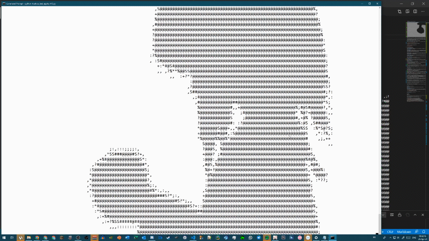
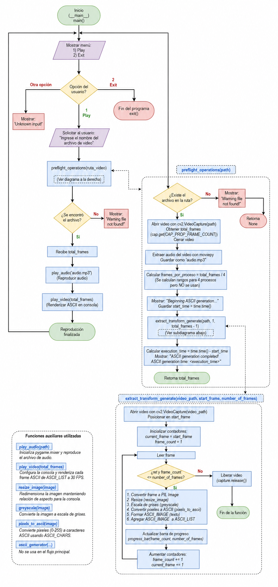

# Bad Apple!! CLI (Python)

> *Bad Apple!! MV rendered directly in the Command Line Interface (CLI) using ASCII characters in Python.*

[](https://www.python.org/)
[]()
[](https://opensource.org/licenses/MIT)

---

## GIF ACA BIEN BONITO, HAY QUE BONITO SE VE AQUI PORQUE ESTA MUY BONITO



---

## Tabla de Contenidos
1. [Descripción del Proyecto](#descripción-del-proyecto)
2. [Selección de Metodología de Desarrollo](#selección-de-metodología-de-desarrollo)
3. [Historias de Usuario (User Stories)](#historias-de-usuario-user-stories)
4. [Arquitectura del Proyecto](#arquitectura-del-proyecto)
5. [Instrucciones de Ejecución](#instrucciones-de-ejecución)
6. [Historial de Optimización y Rendimiento](#historial-de-optimización-y-rendimiento)
7. [Historial de Versiones](#historial-de-versiones)
8. [Problemas Conocidos y Soluciones](#problemas-conocidos-y-soluciones)
9. [Retrospectiva del Proyecto - Práctica 1](#retrospectiva-del-proyecto---práctica-1)
10. [Agradecimientos y Créditos](#agradecimientos-y-créditos)

---

## Descripción del Proyecto

Este proyecto es una aplicación modular basada en CLI desarrollada en Python para la extracción, procesamiento, conversión y renderizado en tiempo real del video musical **Bad Apple!!** en formato ASCII dentro de la terminal de comandos.

### Justificación de la Necesidad
Elegimos este proyecto porque responde al reto técnico de optimizar el procesamiento multimedia en consola. Desde la perspectiva de la Ingeniería de Software, abordar este problema permite explorar y resolver cuellos de botella reales de entrada/salida (I/O) en disco, sincronización de hilos y procesos en paralelo, y gestión eficiente de memoria RAM para gráficos en tiempo real.

> **Aviso de exención de responsabilidad:** Aunque el código final incluye adaptaciones propias, este proyecto es una amalgama de diversos fragmentos de código recopilados en línea. La idea de reproducir *Bad Apple!!* en la terminal no es novedosa; este repositorio se enfoca en el análisis, refactorización y optimización de rendimiento.

**Demo en video:** Puedes ver la demostración original subida a YouTube [haciendo clic aquí](https://www.youtube.com/watch?v=AZfrXrk3ZHc).

---

## Selección de Metodología de Desarrollo

### Enfoque Seleccionado: Metodología Ágil (Kanban)

**Justificación:**
1. **Duración y Flexibilidad:** Dado el marco de tiempo reducido de la práctica, un enfoque ágil nos permite trabajar con entregas incrementales y priorizar los módulos del sistema (audio, procesamiento de imágenes, sincronización FPS) de forma independiente.
2. **Estructura Modular:** Al estar el proyecto dividido en componentes individuales (extracción de cuadros, renderizado ASCII, barra de progreso), Kanban facilita asignar cada funcionalidad mediante *Issues* en GitHub Projects.
3. **Adaptabilidad:** Permite ajustar los requisitos y resolver fallos detectados durante las pruebas (como el desfasaje de tiempo o bloqueos en Linux) sin romper la planificación general.

---

## Historias de Usuario (User Stories)

* **HU-01: Extracción y Procesamiento de Video**
  * **Como** usuario del sistema,
  * **Quiero** descomponer un archivo de video `.mp4` en fotogramas secuenciales,
  * **Para** prepararlos para su posterior conversión a formato ASCII.

* **HU-02: Conversión Gráfica a ASCII**
  * **Como** desarrollador del motor gráfico,
  * **Quiero** transformar cada fotograma a escala de grises y mapear los niveles de brillo a caracteres de texto,
  * **Para** generar la representación visual en la terminal.

* **HU-03: Sincronización de Audio y Frecuencia de Cuadros (FPS)**
  * **Como** usuario final,
  * **Quiero** que la reproducción del audio coincida de manera exacta con el renderizado visual,
  * **Para** evitar acumulaciones de retraso (drift) durante la animación.

* **HU-04: Optimización y Manejo en Memoria RAM**
  * **Como** administrador del sistema,
  * **Quiero** procesar las matrices ASCII directamente en memoria omitiendo archivos `.txt` en almacenamiento físico,
  * **Para** eliminar el cuello de botella de E/S (I/O) y reducir los tiempos de carga previos a 10-15 segundos.

---

## Arquitectura del Proyecto

```text
.
├── bad-apple/
│   ├── modules/              # Módulos de procesamiento (ASCII, audio, video)
│   │   ├── ascii_generator.py # Conversión de píxeles a caracteres ASCII
│   │   ├── audio_player.py    # Motor de audio con Pygame
│   │   └── utils.py           # Generador de barra de progreso
│   ├── assets/                # Archivos multimedia (MP4, GIF)
│   ├── touhou_bad_apple_v4.0.py # Motor ejecutable principal (RAM optimized)
│   ├── requirements.txt       # Lista de dependencias del proyecto
│   └── README.md              # Documentación del repositorio
---
```

## Diagrama de flujo del sistema



```text
┌──────────────┐     ┌──────────────────────┐     ┌─────────────────────┐
│ Archivo MP4  │ ──> │ Extracción de Frames │ ──> │ Redimensionamiento  │
└──────────────┘     │  (OpenCV / FFmpeg)   │     │ & Escala de Grises  │
                     └──────────────────────┘     └─────────────────────┘
                                                             │
                                                             ▼
┌──────────────┐     ┌──────────────────────┐     ┌─────────────────────┐
│ Salida CLI   │ <── │ Sincronización FPS   │ <── │ Mapeo a Caracteres  │
│ (Pantalla)   │     │ (fpstimer + Pygame)  │     │ ASCII en Memoria    │
└──────────────┘     └──────────────────────┘     └─────────────────────┘
```

## Clonar repositorio
```text
git clone [https://github.com/CalvinLoke/bad-apple](https://github.com/CalvinLoke/bad-apple)
cd bad-apple
```

## Instalar dependencias requeridas
```text
pip install -r requirements.txt
```

## Ejecutar la aplicación principal
```text
python touhou_bad_apple_v4.0.py
cd bad-apple
```

## Historial de Optimización y Rendimiento
A lo largo del desarrollo se abordaron múltiples cuellos de botella técnicos mediante refactorización:

Audio & Compatibilidad: Se reemplazó la librería playsound por pygame, solucionando bloqueos en entornos Linux y eliminando el desfasaje de audio.

Precisión de Fotogramas (FPS): Se descartó la función primitiva time.sleep(), sustituyéndola por la librería fpstimer, lo que garantizó un timing exacto por fotograma.

Optimización E/S (I/O Bottleneck): Se reestructuró el pipeline de recursos. Se pasó del esquema lento

```text
VIDEO → IMAGENES EN DISCO → ARCHIVOS.txt → Lectura
```
-------
Al esquema optimizado en memoria
-------
```text
VIDEO → FOTOGRAMAS EN RAM → ASCII EN RAM → RENDERIZADO
```

-------
Esto redujo el tiempo de procesamiento previo a tan solo 10 ~ 15 segundos.
-------

## Historial de versiones
```text
==================================================================================================
Versión   Nombre Original / Estado    Descripción / Cambios Clave
==================================================================================================
v1.0      touhou_bad_apple_v1.py     Versión inicial básica con hilos (threads). Sufría de 
                                     serios problemas de sincronización.
--------------------------------------------------------------------------------------------------
v2.0      touhou_bad_apple_v2.py     Incluye una CLI básica y manejo de E/S de archivos. 
                                     Desarrollado en 24 horas.
--------------------------------------------------------------------------------------------------
v2.5      (Antes v3.0)               Incorporación de pygame para la reproducción de audio. 
                                     Soluciona fallos en sistemas Linux.
--------------------------------------------------------------------------------------------------
v3.0      (Antes v4.0)               Reescritura modular e implementación de multiprocesamiento 
                                     para la extracción de cuadros.
--------------------------------------------------------------------------------------------------
v4.0      (Antes v4.5)               [ESTABLE RECOMENDADA] Reescritura completa del generador 
                                     de recursos. Procesamiento 100% en memoria RAM sin guardar 
                                     archivos .txt en disco.
--------------------------------------------------------------------------------------------------
v4.5      (Antes v5.0)               Permite al usuario procesar y renderizar cualquier video 
                                     personalizado colocándolo en la raíz del proyecto.
==================================================================================================
```

## Problemas Conocidos y Soluciones
1.- Error block=False en Linux: (Resuelto en v2.5)
Causa: La librería playsound no soportaba ejecución no bloqueante en sistemas Unix/Linux.
Solución: Migración a pygame.

2.- Error No such file or directory: 'ExtractedFrames/BadApple_1.jpg': (Versiones v2.5 y v3.0)
Causa: Ocurre cuando el sistema operativo no cuenta con FFmpeg configurado en sus variables de entorno.
Solución: Instalar FFmpeg en el sistema anfitrión antes de ejecutar el script.

## Retrospectiva del Proyecto - Práctica 1
1. ¿Qué funcionó bien?
La migración del procesamiento a la memoria RAM eliminó por completo los retardos de lectura/escritura en disco, mejorando la velocidad de carga de minutos a segundos.
El uso de GitHub Projects permitió gestionar la reestructuración de versiones y solucionar bugs de sincronización de audio mediante Issues.
La integración de fpstimer mantuvo una tasa constante de cuadros por segundo sin desfase en la animación.

2.- ¿Qué no funcionó o generó retrasos?
Las primeras implementaciones de subprocesos e hilos (threading/multiprocessing) introdujeron problemas de condición de carrera y ralentizaron la extracción de imágenes debido a limitaciones del disco (IOPS).
Incompatibilidades de la librería playsound en entornos Linux que requirieron rehacer el módulo de audio.

3.- ¿Qué mejoras implementaremos para el siguiente proyecto?
Implementar un archivo .gitignore adecuado desde el inicio para evitar subir fotogramas extraídos temporales o archivos .txt innecesarios al repositorio.
Diseñar las interfaces pensando en el procesamiento directo en memoria RAM desde la etapa de modelado de arquitectura.

## Agradecimientos y Créditos
```text
==================================================================================================
 AGRADECIMIENTOS ESPECIALES & CRÉDITOS DE LA COMUNIDAD 
=================================================================================================

[ CREACIÓN & UNIVERSO ]
• ZUN / Team Shanghai Alice
  Por la creación del extenso universo de Touhou Project, cimiento y origen de esta obra.

[ AUDIO & VIDEO ORIGINAL ]
• Alstroemeria Records
  Por la composición musical y el Video Musical Original de Bad Apple!!
  Link: [https://www.youtube.com/watch?v=i41KoE0iMYU](https://www.youtube.com/watch?v=i41KoE0iMYU)

• Ronald Macdonald
  Por la elaboración del Arreglo MIDI utilizado para la sincronización de audio.
  Link: [https://www.youtube.com/watch?v=ANRzDT1pU8c](https://www.youtube.com/watch?v=ANRzDT1pU8c)

[ COLABORADORES EN GITHUB ]
• karoush1    -> Contribuciones directas y refactorización del código base.
• JasperTecHK -> Pruebas de compatibilidad y soporte multiplataforma.
• TheHusyin   -> Gestión de dependencias e integración del archivo requirements.txt.
• Mirageofmage -> Retroalimentación y optimización del rendimiento en ejecución.
==================================================================================================
```
